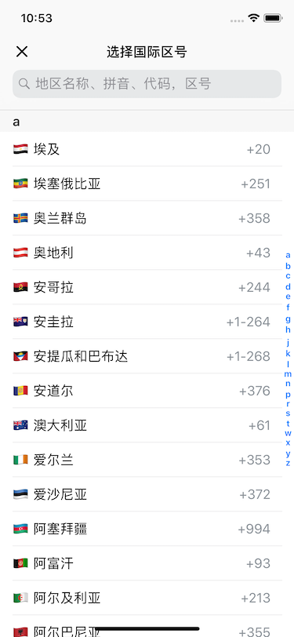

# LXCountryCallingCodePicker

[](https://cocoapods.org/pods/LXCountryCallingCodePicker)
[](https://cocoapods.org/pods/LXCountryCallingCodePicker)
[](https://cocoapods.org/pods/LXCountryCallingCodePicker)

有国旗图案的国家区号选择器，包含 250 个国家地区，支持中英文，支持通过地区名称、拼音、代码和区号搜索。

> 国旗是 **emoji**，[Flags](./Flags) 文件夹内提供了 **250** 个国家地区的 **png** 格式国旗图片。



## Example

```ruby
pod 'LXCountryCallingCodePicker'
```

```swift
import LXCountryCallingCodePicker
```

```swift
CallingCodeMetadataStore.language = .chinese
let picker = CallingCodePickerController()
picker.navigationBar.tintColor = .black
picker.title = "选择国际区号"
picker.didSelectMetadata = { [weak self] metadata in
	guard let self = self else { return }
	self.codeLabel.text = metadata.regionFlag + " " + metadata.callingCode
	self.dismiss(animated: true, completion: nil)
}
present(picker, animated: true, completion: nil)
```
